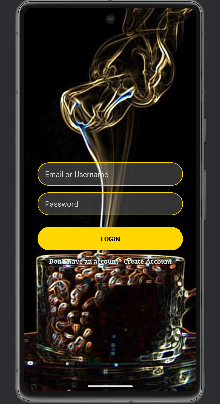
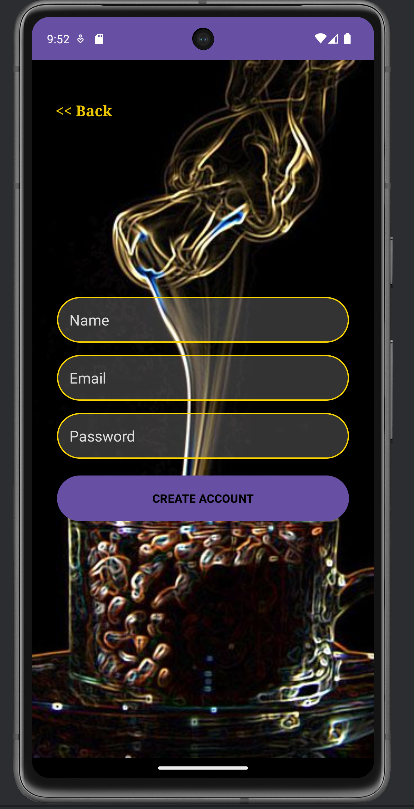
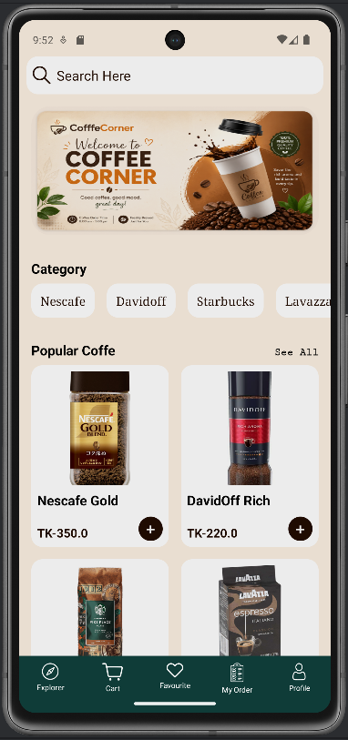
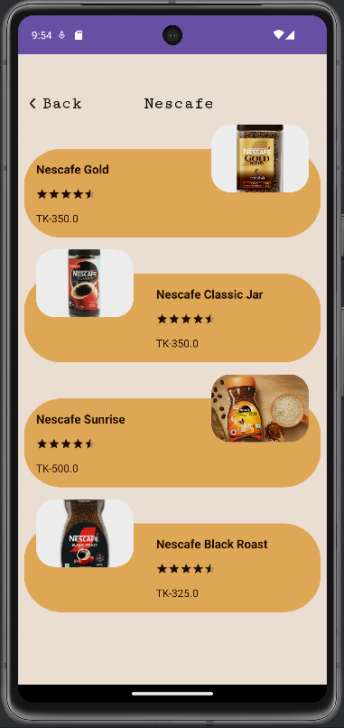
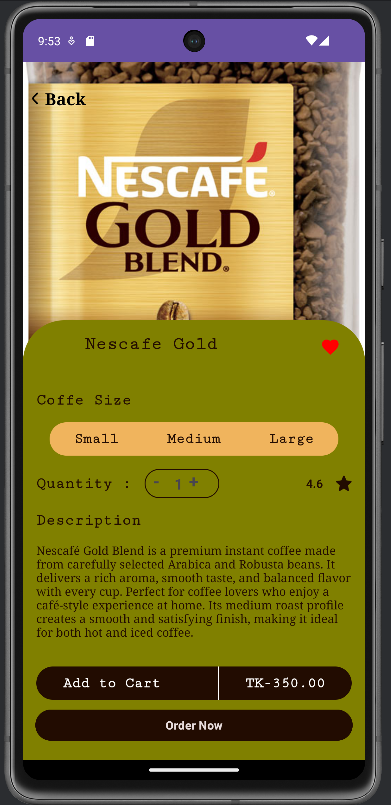
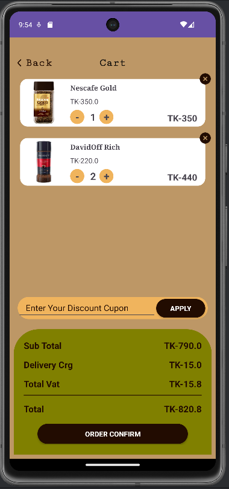
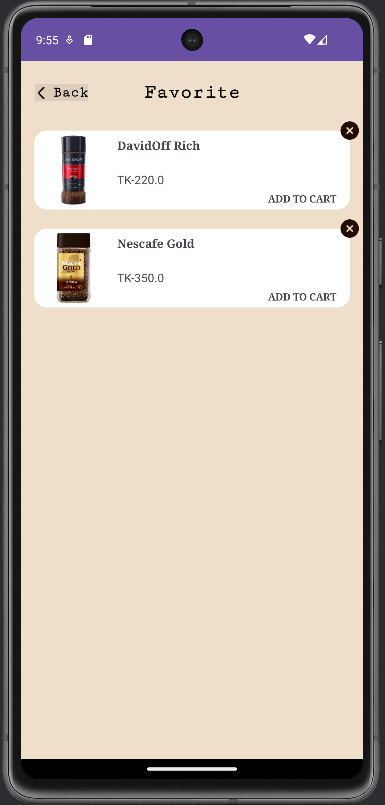
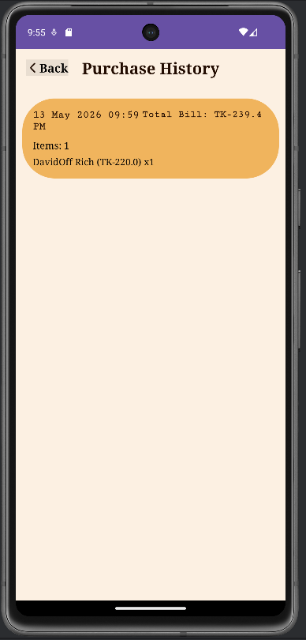
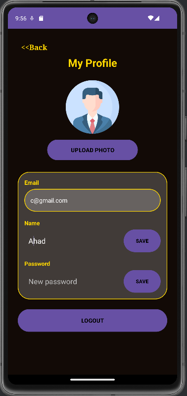

# CoffeeCorner ☕
CoffeeCorner is a modern Android coffee ordering application developed using Kotlin and Firebase.  
The app allows users to browse coffee items, manage carts, save favorites, and place orders easily.

# Features
- User Login & Registration
- Firebase Authentication
- Firebase Realtime Database
- Coffee Categories
- Search Functionality
- Add to Cart System
- Favorite Items
- Order History
- Profile Management
- Responsive UI Design

# Technologies Used
- Kotlin
- Firebase Authentication
- Firebase Realtime Database
- Glide
- RecyclerView
- MVVM Architecture

# Screenshots

## 1. Splash/Login Screen

This is the initial authentication screen of the application.  
Users can log in using email and password or navigate to the registration page.

## 2. Register Screen

This screen allows new users to create an account.  
User information is securely stored using Firebase Authentication and Realtime Database.

## 3. Home Screen

The home screen displays banners, coffee categories, and popular coffee items.  
Users can search products and navigate through different sections using the bottom menu.

## 4. Category Screen

This screen displays coffee items based on selected categories.  
Users can easily browse and explore different coffee types.

## 5. Detail Screen

The detail screen shows complete information about a selected coffee item.  
Users can select coffee size, quantity, add items to favorites, or place orders.

## 6. Cart Screen

This screen displays all added cart items with price calculations.  
Users can apply discount coupons and confirm their orders.

## 7. Favorite Screen

This screen contains all favorite coffee items saved by the user.  
Users can quickly access and manage their preferred products.

## 8. My Order Screen

This screen displays previously confirmed orders and order history.  
Users can review all past purchases from this section.

## 9. Profile Screen

This screen shows user profile information and editing options.  
Users can update profile image, username, and password easily.
